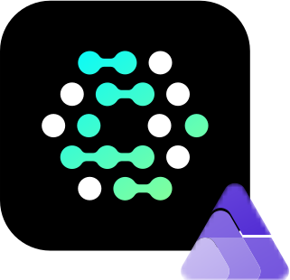

<p align="center">
  
  <h1 align="center">Aspire OpenFGA</h1>
</p>

---

[Aspire](https://aspire.dev) hosting integration for [OpenFGA](https://openfga.dev/).

- [Installation](#installation)
- [Usage](#usage)
- [Engines](#engines)
    - [Postgres](#postgres)
    - [MySQL](#mysql)
    - [SQLite](#sqlite)
- [Playground](#playground)
- [Model Definition](#model-definition)
- [Client Callbacks](#client-callbacks)

---

# Installation

[](https://www.nuget.org/packages/Toothless.Aspire.Hosting.OpenFga)
[](https://www.nuget.org/packages/Toothless.Aspire.Hosting.OpenFga.Postgres)
[](https://www.nuget.org/packages/Toothless.Aspire.Hosting.OpenFga.MySql)
[](https://www.nuget.org/packages/Toothless.Aspire.Hosting.OpenFga.Sqlite)

Core package: `Toothless.Aspire.Hosting.OpenFga`

Engine packages:

- `Toothless.Aspire.Hosting.OpenFga.Postgres`
- `Toothless.Aspire.Hosting.OpenFga.MySQL`
- `Toothless.Aspire.Hosting.OpenFga.Sqlite`

> [!NOTE]
> The packages are also available on GitHub packages without the `Toothless.` prefix

# Usage

By defailt AddOpenFga will setup a store with `http` and `grpc` endpoints with the engine
set to in-memory. Contianers can be added using `AddStore` and models imported from files
using `WithModelDefinition`.

```c#
var openFga = builder.AddOpenFga("openfga");

var store = openFga.AddStore("my-store")
    .WithModelDefinition("models", Path.Join(builder.AppHostDirectory, "Models"), "fga.mod");

builder.AddProject<MyProject>("project")
    .WithEnvironment("OpenFga__Connection", store.HttpEndpoint)
    .WithEnvironment("OpenFga__Store", store)
```

The `AddStore` method will adopt the Store ID of an existing store in the `openFga` resource
if a store with the same name already exists.

# Engines

### Postgres

To use the postgres engine install `Toothless.Aspire.Hosting.OpenFga.Postgres` and call `WithDatastore`
on the OpenFGA resource.

```c#
var database = builder.AddPostgres("postgres")
    .AddDatabase("db");

builder.AddOpenFga("openfga")
    .WithDatastore(database);
```

> [!NOTE]
> This depends on `Aspire.Hosting.PostgreSQL`

### MySql

To use the postgres engine install `Toothless.Aspire.Hosting.OpenFga.MySQL` and call `WithDatastore`
on the OpenFGA resource.

```c#
var database = builder.AddMySql("mysql")
    .AddDatabase("db");

builder.AddOpenFga("openfga")
    .WithDatastore(database);
```

> [!NOTE]
> This depends on `Aspire.Hosting.MySql`

### Sqlite

To use the postgres engine install `Toothless.Aspire.Hosting.OpenFga.Sqlite` and call `WithDatastore`
on the OpenFGA resource.

```c#
var database = builder.AddSqlite("sqlite");

builder.AddOpenFga("openfga")
    .WithDatastore(database);
```

> [!NOTE]
> This depnds on `CommunityToolkit.Aspire.Hosting.Sqlite`

### Custom Engine

To use a custom engine users shoud call `WithDatastore(engine, datastoreUri)` on the OpenFGA
resource. This will return an instance of `IResourceBuilder<OpenFgaDatastoreResource>` configuring
the parent `OpenFgaResource`'s and the `OpenFgaDatastoreResource` resources
`OPENFGA_DATASTORE_ENGINE`, `OPENFGA_DATASTORE_URI` environment variables. The relationshiop between
the `OpenFgaDatastoreResource` and `OpenFgaResource` resource is also configured such that the
`OpenFgaResource` will wait for the completion of the `OpenFgaDatastoreResource`.

## Playground

The playground can be enabled by calling `WithPlayground` on the OpenFGA resource. This will
add a new "playground" endpoint to the OpenFGA resource.

```c#
builder.AddOpenFga("openfga")
    .WithPlayground();
```

> [!IMPORTANT]
> When the playground is enabled the `http` endpoint will not be proxied by Aspire

## Model Definition

Models can be imported from files using `WithModelDefinition`. This will import the modes from the
specified path into the store the method was called on.

```c#
builder.AddOpenFga("openfga")
    .AddStore("my-store")
    .WithModelDefinition("models", Path.Join(builder.AppHostDirectory, "Models"), "fga.mod");
```

## Client Callbacks

For arbitrary client callbacks use `WithClientCallback`. This will add a callback that will be called
when the resource is started. The callback is provided with a `OpenFgaClient` instance that is
configured to connect a store when used on a store resource.

```c#
builder.AddOpenFga("openfga")
    .AddStore("my-store")
    .WithClientCallback(static async (ctx, ct) =>
    {
        await ctx.Client.ReadAuthorizationModels(
            new ClientReadAuthorizationModelsOptions(),
            cancellationToken: ct);
    });
```

> [!IMPORTANT]
> Ordering is not guaranteed between `WihthModelDefinition` and `WithClientCallback`

## Tracing

By default, pusing otel traces into Aspire is disabled. To enable `WithTracing` should be used. This
will use a sample rate of 100% by default when enabled.

```c#
builder.AddOpenFga("openfga")
    .WithTracing(sampleRaito: 1);
```

## Metrics

By default, the metrics endpoint is disabled. To enable `WithMetrics` should be used. By default this will
proxy the metrics endpoint.

```c#
builder.AddOpenFga("openfga")
    .WithMetrics(port: 2112, proxy: true);
```
